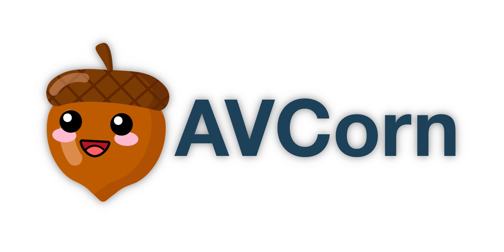

# AVCorn

[](https://app.codacy.com/gh/blaher/avcorn/dashboard?utm_source=gh&utm_medium=referral&utm_content=&utm_campaign=Badge_grade)
[](https://coveralls.io/github/AVCorn/avcorn?main)
[](https://www.gnu.org/licenses/gpl-3.0)

AVCorn is a simple AVC Content Management System for basic content websites, no databases required.
AVC standing for Actions, Views Controllers; no Models nessicary.
The intent for AVCorn is easy deploying, fast developing, low complexity, and lightweight performance for low traffic website design clients.
Yet still scalable and capable of handling larger content traffic.
Written in PHP, and utilizing the Twig templating engine.



_"The nut doesn't fall from from the tree!"_

## Application Environment

### Install the Application (Locally)

You will require PHP 8.2 or newer.

To run the application in development, you can run this command:

```bash
cd code
composer start
```

Or you can use `docker-compose` to run the app with `docker`, so you can run this command (no need to `cd`):
```bash
docker-compose up -d
```
After that, open `http://localhost:8080` in your browser.

Run this command in the application directory to run the test suite

```bash
composer test
```

That's it!

### Run Production (Docker)

In order to run the environment in a production level environment:
```bash
. avcorn.sh start
```

We offer a convient way to shell in to this container:
```bash
. avcorn.sh shell
```

If you want to clean up the docker containers made:
```bash
. avcorn.sh stop
```

### Install the Application Remotely (AWS)

```bash
. avcorn.sh deploy
```

## Links

*   [Templates](https://github.com/avcorn/avcorn-templates)
*   [Development Progress](docs/TODO.md)
*   [Contributing Guidelines](docs/CONTRIBUTING.md)
*   [Reporting a Security Issue](docs/SECURITY.md)
*   [Coding Standards](docs/STANDARDS.md)
*   [Pattern Design](docs/PATTERNS.md)
*   [Infastructure Design](docs/INFASTRUCTURE.md)
*   [Developer Tools](docs/TOOLS.md)
*   [CLI Guide](docs/CLI.md)
*   [License](docs/LICENSE.md)
*   [Web Elements (Parent Company)](http://webelements.agency)
*   [GitHub](https://github.com/avcorn/avcorn)
